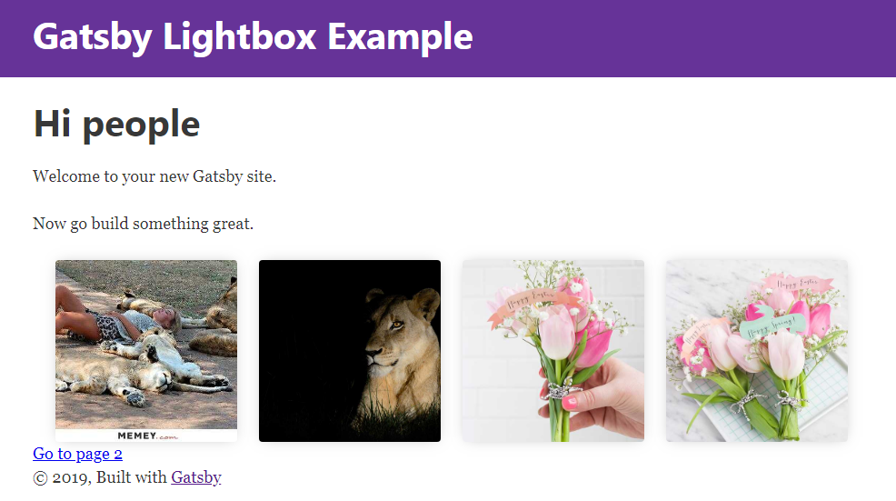

## Example using gatsby-image to built a custom lightbox carousel with @lightbox-react

https://github.com/treyhuffine/lightbox-react

## Avoiding stretched images using the fluid type

Images using the fluid type are stretched to match the container’s width. In the case where the image’s width is smaller than the available viewport, the image will stretch to match the container, potentially leading to unwanted problems and worsened image quality.

To counter this edge case I wraped the Img component in HOC NonStretchedImage in order to set maxWidth.

**Note**: The **GatsbyImageSharpFluid** fragment does not include **presentationWidth**. You need to add it in the graphql query manually.

Details in Docs  
https://www.gatsbyjs.org/packages/gatsby-image/

[codesandbox](https://codesandbox.io/s/n7r3rxl1jl)

